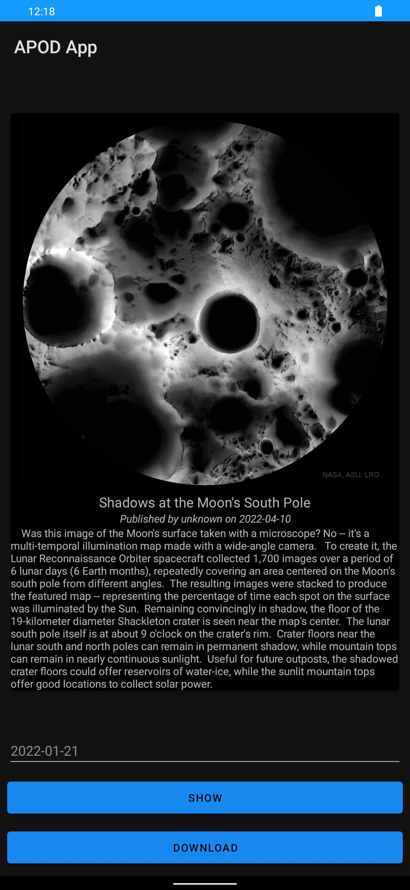

<div align = "center">

<h1><a href="https://2kabhishek.github.io/APODApp">APODApp</a></h1>

<a href="https://github.com/2KAbhishek/APODApp/blob/main/LICENSE">
 </a>

<a href="https://github.com/2KAbhishek/APODApp/graphs/contributors">
 </a>

<a href="https://github.com/2KAbhishek/APODApp/stargazers">
</a>

<a href="https://github.com/2KAbhishek/APODApp/network/members">
 </a>

<a href="https://github.com/2KAbhishek/APODApp/watchers">
 </a>

<a href="https://github.com/2KAbhishek/APODApp/pulse">
 </a>

<h3>Astrology Pictures everyday 🔭🌌</h3>

<figure>
  
  <br/>
  <figcaption>APODApp screenshot</figcaption>
</figure>

</div>

## What is this

APODApp gets astrology pictures from NASA everyday on your phone.

## Inspiration

Wanted to try out the APOD API.

## Prerequisites

Before you begin, ensure you have met the following requirements:

- You have installed the latest version of `Android Studio`

## Getting APODApp

To install APODApp, follow these steps:

```bash
git clone https://github.com/2kabhishek/APODApp
cd APODApp
```

## How it was built

APODApp was built using `Java`, `Android Studio` and `APOD API`.

## Challenges faced

- Working with dates was interesting

## What I learned

- Image fetching with JSON
- Android thread policies
- Why we shouldn't do async tasks on the main thread
- How to override that behaviour with `StrictMode` thread policy

Hit the ⭐ button if you found this useful.

## More Info

<div align="center">

<a href="https://github.com/2KAbhishek/APODApp">Source</a> | <a href="https://2kabhishek.github.io/APODApp">Website</a>

</div>
